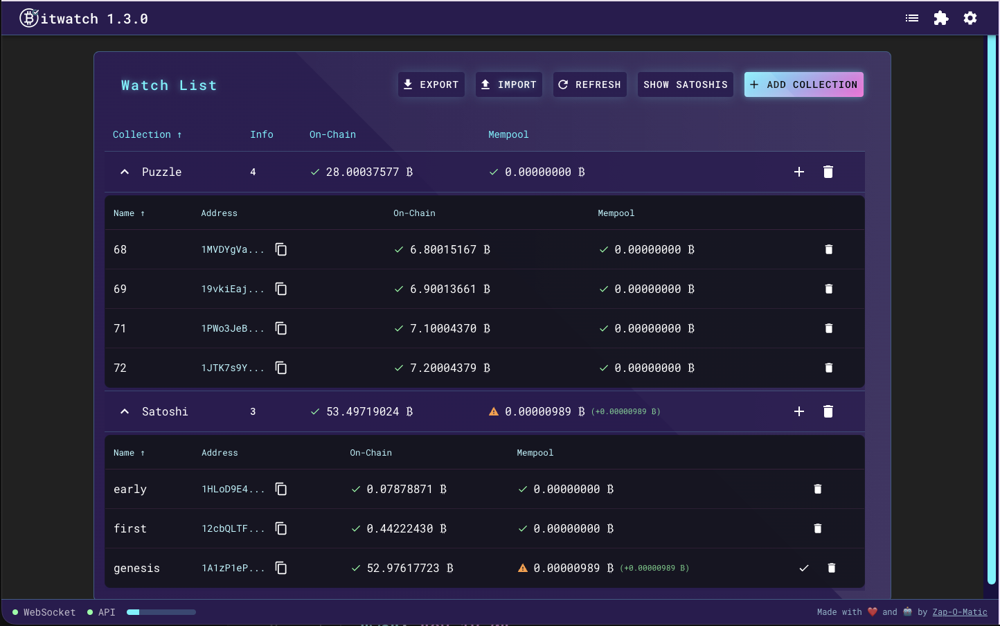

# Bitwatch

> Monitor Bitcoin addresses in the mempool and on-chain using the mempool.space API. Run your own node and monitor your own addresses privately. Get Telegram notifications for onchain and mempool activity relating to addresses.



## Features

- Real-time monitoring of Bitcoin addresses
- Track both on-chain and mempool activity
- Set and manage balance expectations
- Mobile responsive design
- Telegram notifications for balance changes
- Integration with mempool.space API
- Option to use your own local node for privacy

## Why?

There are many reasons you might want automated monitoring of Bitcoin addresses. Here are some examples:

- Know when Satoshi's coins move
- Observe a set of P2PK addresses to get alerted if Quantum attacks become a reality
- Monitor honey pot keys that you've placed in plaintext across accounts (email, cloud storage, etc) to learn if/when those get compromised
- Monitor reserve wallets for exchanges
- Monitor Donation addresses for activity (for instance, this project address: bc1q67csgqm9muhynyd864tj2p48g8gachyg2nwara)

## Installation

### As a Docker Container

```bash
# make a directory for bitwatch data
mkdir ~/.bitwatch

# run the container
docker run --rm --name bitwatch -p 3117:3117 -v ~/.bitwatch:/app/server/data ghcr.io/zapomatic/bitwatch:latest

# stop and remove the container
docker stop bitwatch
```

### As an Umbrel App

Umbrel Home or greater hardware is recommended for running a sovereign monitoring node.

> COMING SOON

1. Click the "Install" button in the Umbrel app store
2. Wait for installation to complete
3. Access Bitwatch through your Umbrel dashboard

### Sovereign Monitoring Mode

If the desire is to run a sovereign monitoring node (for privacy reasons), the following steps can be taken:

1. Install the Umbrel app (or run docker container on desired hardware)
2. Install Fulcrum (faster electrum server, using Electrs will return 502 errors looking up address data on an Umbrel Home or Raspberry Pi device)
3. Install Mempool app
4. Configure Mempool to use Fulcrum as the server (right click on the Mempool app and under Settings, set the server to Fulcrum)
5. Wait for Fulcum/Mempool to sync
6. Restart Mempool
7. Configure Bitwatch to use the local Mempool instance in the app UI configure page: `http://10.21.21.26:3006`
   - https://github.com/getumbrel/umbrel-apps/blob/master/mempool/exports.sh#L1C24-L1C35
8. (optional) Configure Bitwatch to use a Telegram bot for notifications in the integrations page

### Development Setup

```bash
npm run setup
npm run dev
```

## Some Interesting Addresses to Monitor

By default, the app will ship monitoring the following addresses (as examples):

1. **Genesis Block Reward** - `1A1zP1eP5QGefi2DMPTfTL5SLmv7DivfNa`
   - The original bitcoin genesis block reward address
   - Technically unspendable, but receives frequent transactions from Runestones
   - Great for testing monitoring functionality
2. **The Hal Finney Address** - `12cbQLTFMXRnSzktFkuoG3eHoMeFtpTu3S`
   - The first user-to-user transaction source address in Bitcoin, sent to Hal Finney
3. **Early Block Reward Address** - `1HLoD9E4SDFFPDiYfNYnkBLQ85Y51J3Zb1`
   - One of the early block reward payout addresses (but the reward was moved)

Of course, services like [Arkham](https://intel.arkm.com/explorer/entity/satoshi-nakamoto) have a full tracker for Satoshi's addresses, but we want to check our own addresses (and probably privately with our own node)

## Contributing

Pull requests are welcome. For major changes, please open an issue first to discuss what you would like to change.

## License

ISC

## Donations

If you'd like to donate to the project, you can send BTC to the following address:

```
bc1q67csgqm9muhynyd864tj2p48g8gachyg2nwara
```

Or keysend a thanks over LN to: Zap-O-Matic:

```
026d0169e8c220d8e789de1e7543f84b9041bbb3e819ab14b9824d37caa94f1eb2
```

https://zapomatic.github.io/
